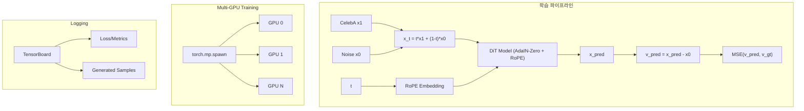

# CelebA Rectified Flow with DiT (AdaIN-Zero + RoPE)

## 아키텍처 개요



## 기술 스택
- **모델**: DiT (Diffusion Transformer) with AdaIN-Zero conditioning
- **Time Embedding**: RoPE (Rotary Position Embedding)
- **Loss**: x-prediction → v 변환 후 v_gt와 MSE
- **분산 학습**: `torch.multiprocessing.spawn` (DDP)
- **Tracking**: TensorBoard
- **Config**: argparse
- **평가**: FID Score (pytorch-fid)

## 프로젝트 구조

```
CelebGen/
├── src/
│   ├── __init__.py
│   ├── models/
│   │   ├── __init__.py          # build_model()
│   │   ├── dit.py               # DiT 메인 모델
│   │   ├── adain_zero.py        # AdaIN-Zero 블록
│   │   └── rope.py              # RoPE Time Embedding
│   ├── datasets/
│   │   ├── __init__.py          # build_dataset()
│   │   └── celeba.py            # CelebA Dataset
│   └── losses/
│       ├── __init__.py          # build_loss()
│       └── flow_matching.py     # x→v 변환 + MSE Loss
├── scripts/
│   ├── train.py                 # Multi-GPU 학습 스크립트
│   └── test.py                  # 샘플링/생성 스크립트
├── eval/
│   └── fid.py                   # FID Score 계산
├── configs/
│   └── default.py               # 기본 설정값 참조용
├── data/                        # CelebA 데이터
├── experiments/                 # 실험별 저장소
│   └── {exp_name}/
│       ├── checkpoints/         # 모델 체크포인트
│       ├── logs/                # TensorBoard 로그
│       └── samples/             # 생성 샘플 이미지
├── app.py                       # Gradio 웹 데모
├── requirements.txt
└── README.md                    # 전체 플로우 및 설치 가이드
```

## 코딩 규칙

### 테스트 가능한 모듈 구조
모든 Python 스크립트는 `if __name__ == "__main__":` 블록을 포함하여 개별 테스트가 가능해야 합니다:

```python
# 예시: src/models/rope.py
class RoPE(nn.Module):
    ...

if __name__ == "__main__":
    # 단위 테스트
    rope = RoPE(dim=256)
    x = torch.randn(2, 16, 256)
    out = rope(x)
    print(f"Input: {x.shape} -> Output: {out.shape}")
```

적용 대상 파일:
- `src/models/rope.py`
- `src/models/adain_zero.py`
- `src/models/dit.py`
- `src/datasets/celeba.py`
- `src/losses/flow_matching.py`
- `scripts/train.py`
- `scripts/test.py`
- `eval/fid.py`
- `app.py`

---

## 핵심 구현 상세

### 1. DiT with AdaIN-Zero
- Transformer 블록에 AdaIN-Zero로 time conditioning 주입
- `scale, shift = MLP(t_emb)` → `x = x * (1 + scale) + shift`
- Zero-initialized output projection for stable training

### 2. RoPE Time Embedding
- Sinusoidal 대신 Rotary Position Embedding 사용
- 시간 정보를 attention의 query/key에 회전 변환으로 주입

### 3. Loss (x-prediction → v)
```python
# x_pred: 모델이 예측한 x1
# v_pred = x_pred - x0 (예측 velocity)
# v_gt = x1 - x0 (실제 velocity)
loss = MSE(v_pred, v_gt)
```

### 4. Multi-GPU Training (spawn)
```python
torch.multiprocessing.spawn(
    train_worker,
    args=(world_size, args),
    nprocs=world_size
)
# 각 worker에서 DistributedDataParallel 사용
```

### 5. 실험 관리
```bash
python scripts/train.py --exp_name my_experiment_v1 ...
# 저장 경로: experiments/my_experiment_v1/{checkpoints,logs,samples}
```

## 주요 argparse 인자

| 인자 | 설명 | 기본값 |
|------|------|--------|
| `--exp_name` | 실험 이름 | required |
| `--data_root` | CelebA 데이터 경로 | `./data` |
| `--image_size` | 이미지 크기 | 64 |
| `--batch_size` | 배치 크기 (per GPU) | 32 |
| `--epochs` | 학습 에폭 | 100 |
| `--lr` | Learning rate | 1e-4 |
| `--num_sampling_steps` | ODE 샘플링 스텝 | 50 |
| `--resume` | 체크포인트 경로 | None |

## 설치 및 실행

```bash
# 1. 환경 설정
pip install -r requirements.txt

# 2. 학습 (Multi-GPU)
python scripts/train.py --exp_name celeba_dit_v1 --epochs 100

# 3. 테스트/샘플링
python scripts/test.py --exp_name celeba_dit_v1 --checkpoint best.pt

# 4. FID 평가
python eval/fid.py --exp_name celeba_dit_v1 --num_samples 10000

# 5. 웹 데모
python app.py --checkpoint experiments/celeba_dit_v1/checkpoints/best.pt
```

---

## 구현 체크리스트

### 프로젝트 설정
- [ ] 프로젝트 구조 생성 및 requirements.txt 작성

### Models
- [ ] `src/models/rope.py` - RoPE Time Embedding 구현 + `if __name__` 테스트
- [ ] `src/models/adain_zero.py` - AdaIN-Zero 블록 구현 + `if __name__` 테스트
- [ ] `src/models/dit.py` - DiT 메인 모델 구현 + `if __name__` 테스트
- [ ] `src/models/__init__.py` - build_model() 함수

### Datasets
- [ ] `src/datasets/celeba.py` - CelebA Dataset 클래스 + `if __name__` 테스트
- [ ] `src/datasets/__init__.py` - build_dataset() 함수

### Losses
- [ ] `src/losses/flow_matching.py` - x→v 변환 Loss + `if __name__` 테스트
- [ ] `src/losses/__init__.py` - build_loss() 함수

### Scripts
- [ ] `scripts/train.py` - Multi-GPU spawn 학습 + TensorBoard + `if __name__` 테스트
- [ ] `scripts/test.py` - ODE 샘플링 및 이미지 생성 + `if __name__` 테스트

### Evaluation
- [ ] `eval/fid.py` - FID Score 계산 + `if __name__` 테스트

### Demo & Docs
- [ ] `app.py` - Gradio 웹 데모 + `if __name__` 테스트
- [ ] `README.md` - 설치/실행/플로우 문서화

